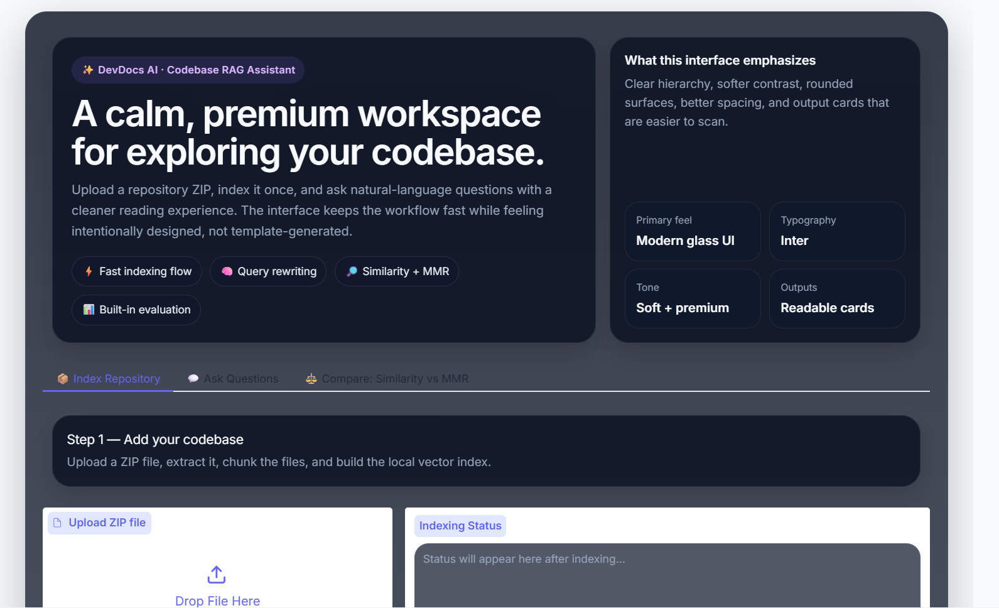
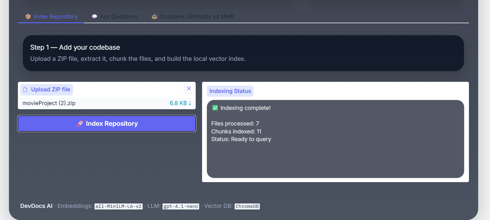

# DevDocsAI

# DevDocs AI — Codebase RAG Assistant

A production-quality **Retrieval-Augmented Generation** system for querying codebases with natural language. Upload any ZIP archive, index it once, and ask questions about the code.


## Architecture

```
User Query
    │
    ▼
[Query Rewriter]  ← optional rule-based or LLM rewrite
    │
    ▼
[Retriever]  ← similarity search OR MMR (configurable)
    │         ChromaDB + HuggingFace all-MiniLM-L6-v2 embeddings
    ▼
[Retrieved Chunks]
    │
    ├──→ [LLM Generator]  → Answer  (gpt-4.1-nano, 1 call)
    │
    └──→ [Evaluator]
              ├── Retrieval Metrics (Recall@K, MRR, nDCG) — FREE
              └── LLM Judge (Accuracy, Completeness, Relevance, Groundedness) — 1 call
```

## Cost Model

| Operation            | Cost             |
|----------------------|------------------|
| Embedding (indexing) | **FREE** (local) |
| Embedding (query)    | **FREE** (local) |
| Answer generation    | ~$0.0001 / query |
| LLM judge evaluation | ~$0.0001 / query |
| Query rewriting (LLM)| ~$0.00005 / query|

> At $5 budget you can run ~25,000 queries with full evaluation enabled.


## Project Structure

```
devdocs-ai/
├── app.py                    # Gradio UI (3 tabs)
├── config.py                 # All configuration in one place
├── requirements.txt
├── .env.example
│
├── ingestion/
│   ├── __init__.py
│   ├── loader.py             # ZIP extraction + file reading
│   ├── chunker.py            # AST-aware Python chunking + generic splitter
│   └── indexer.py            # HuggingFace embeddings + ChromaDB persistence
│
├── retrieval/
│   ├── __init__.py
│   ├── retriever.py          # Similarity + MMR search
│   └── query_rewriter.py     # Rule-based + optional LLM rewrite
│
├── llm/
│   ├── __init__.py
│   └── generator.py          # Grounded answer generation via litellm
│
├── evaluation/
│   ├── __init__.py
│   ├── metrics.py            # Recall@K, MRR, nDCG (free, keyword-based)
│   └── judge.py              # LLM-as-judge (Accuracy/Completeness/Relevance/Groundedness)
│
├── utils/
│   ├── __init__.py
│   └── helpers.py            # Logging, display formatters
│
└── data/
    ├── uploads/              # Extracted ZIP contents (auto-created)
    └── vector_db/            # ChromaDB persistent storage (auto-created)
```

## Quick Start

### 1. Clone / download the project

```bash
cd devdocs-ai
```

### 2. Create virtual environment

```bash
python -m venv venv
source venv/bin/activate        # Linux/macOS
# venv\Scripts\activate         # Windows
```

### 3. Install dependencies

```bash
pip install -r requirements.txt
```

> First run will download the `all-MiniLM-L6-v2` model (~90 MB) automatically.

### 4. Set your OpenAI API key

```bash
cp .env.example .env
# Edit .env and set OPENAI_API_KEY=sk-...
```

Or export directly:

```bash
export OPENAI_API_KEY="sk-your-key-here"
```

### 5. Launch the app

```bash
python app.py
```

Open **http://localhost:7860** in your browser.

---

## Usage Guide

### Tab 1 — Index Repository

1. Click **Upload ZIP file** and select your repository archive.
2. Click **🚀 Index Repository**.
3. Wait for the status message — indexing is one-time per repository.

> Re-indexing a new ZIP clears the previous index automatically.

### Tab 2 — Ask Questions

1. Type a natural language question.
2. Configure retrieval options:
   - **Top-K**: number of chunks to retrieve (default 5)
   - **Use MMR**: diversity-aware retrieval (avoids redundant chunks)
   - **Use query rewriting**: expands abbreviations before retrieval
   - **Run evaluation**: computes all metrics (costs 1 extra LLM call)
3. Click **🔍 Ask**.
4. View the **Answer**, **Retrieved Chunks**, and **Metrics Panel**.
 
 

### Tab 3 — Compare Modes

Run both **Similarity** and **MMR** retrieval side-by-side for the same question to compare answer quality and chunk diversity.
  
---

## Configuration Reference

All parameters are in `config.py`:

| Parameter              | Default               | Description                              |
|------------------------|-----------------------|------------------------------------------|
| `EMBEDDING_MODEL`      | `all-MiniLM-L6-v2`   | HuggingFace sentence-transformer model   |
| `CHUNK_SIZE`           | `400` tokens          | Target chunk size                        |
| `CHUNK_OVERLAP`        | `60` tokens           | Overlap between consecutive chunks      |
| `DEFAULT_TOP_K`        | `5`                   | Chunks retrieved per query               |
| `MMR_FETCH_K`          | `20`                  | Candidate pool size for MMR              |
| `MMR_LAMBDA_MULT`      | `0.5`                 | MMR diversity/relevance balance (0–1)    |
| `LLM_MODEL`            | `openai/gpt-4.1-nano` | LLM for answer generation                |
| `LLM_MAX_TOKENS`       | `1024`                | Max tokens in LLM response               |
| `ALLOWED_EXTENSIONS`   | `.py .js .ts .md ...` | File types included in indexing          |
| `MAX_FILE_SIZE_MB`     | `2`                   | Files larger than this are skipped       |

---

## Evaluation Metrics Explained

### Retrieval Metrics (free, keyword-based proxy)

| Metric     | Formula                                          | Range |
|------------|--------------------------------------------------|-------|
| Recall@K   | relevant retrieved / K                           | 0–1   |
| MRR        | 1 / rank of first relevant doc                   | 0–1   |
| nDCG@K     | DCG / IDCG using binary relevance                | 0–1   |

> Relevance is determined by keyword overlap between query and chunk (≥2 shared tokens).

### Answer Quality (LLM judge, 1 call)

| Dimension     | Meaning                                           | Scale |
|---------------|---------------------------------------------------|-------|
| Accuracy      | Every claim is factually correct given context    | 1–5   |
| Completeness  | All parts of the question are addressed           | 1–5   |
| Relevance     | Answer is focused and on-topic                    | 1–5   |
| Groundedness  | All claims are directly supported by context      | 1–5   |
| Overall       | Mean of the four scores                           | 1–5   |

---
 
## Supported File Types

`.py` `.js` `.ts` `.jsx` `.tsx` `.md` `.txt` `.java` `.go` `.rs` `.cpp` `.c` `.h`

---

## Chunking Strategy

| File Type     | Strategy                                                        |
|---------------|-----------------------------------------------------------------|
| `.py`         | AST-based: one chunk per top-level function/class               |
| All others    | Recursive character splitter (400-token chunks, 60-token overlap)|

Python files that fail AST parsing (e.g. syntax errors) fall back to the generic splitter automatically.

---

## Troubleshooting

**"Vector store is empty" error**
→ Index a repository first via Tab 1.

**Slow first query**
→ The embedding model is downloaded on first use (~90 MB). Subsequent runs are fast.

**"No API key" warnings**
→ Set `OPENAI_API_KEY` in `.env` or as an environment variable.

**ChromaDB dimension mismatch error**
→ Delete `data/vector_db/` and re-index. This happens if you switch embedding models mid-session.

```bash
rm -rf data/vector_db/
```

**Out of memory on large repos**
→ Lower `MAX_FILE_SIZE_MB` in `config.py` or reduce `CHUNK_SIZE`.